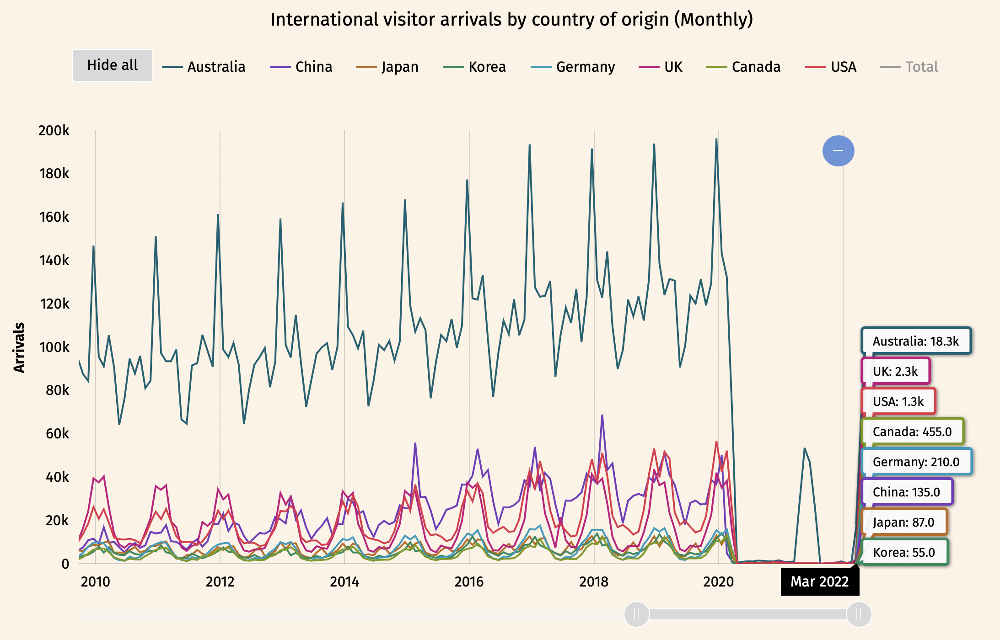
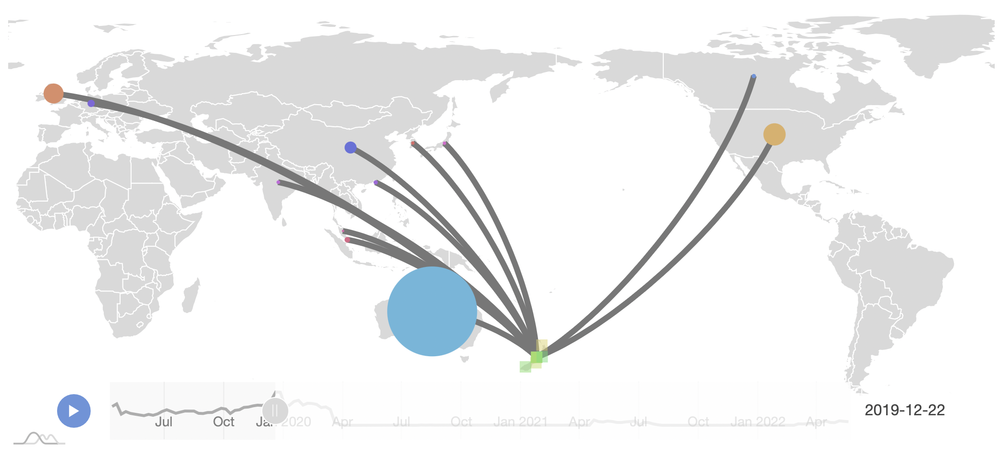
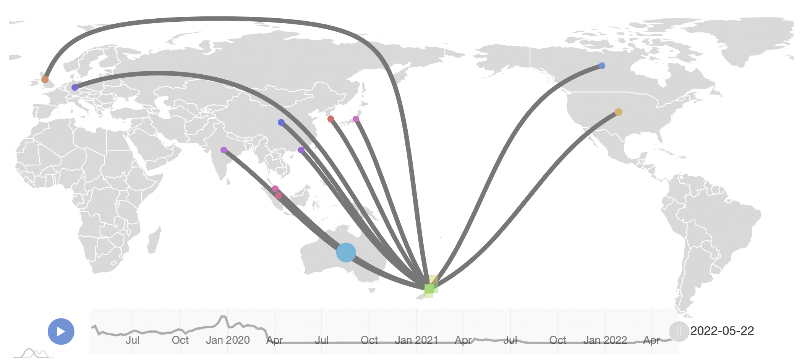
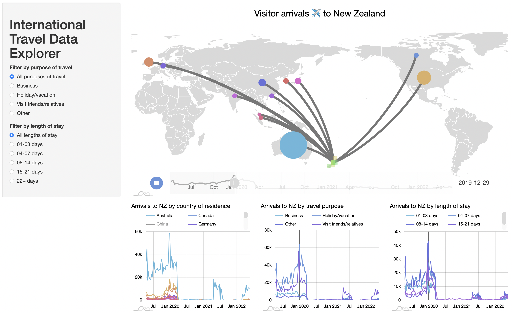
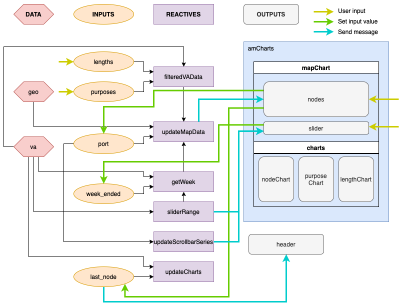

# 1. Introduction
StatsNZ publishes the International Travel dataset monthly, which breaks down border movements entering or leaving New Zealand by a variety of dimensions. This dataset has traditionally been used by (among other use cases) the tourism industry to understand the potential international visitor market and its seasonality, and thus where to best expend efforts such as marketing, or to benchmark operators' historical performance based on the market available to them at the time.

StatsNZ only visualises International Travel data as an overall time series, with no easy, accessible method for breaking down the time series by the different dimensions available in the dataset. Someone like a tourism operator would have to overcome the learning curve to extract meaningful insights from the spreadsheets StatsNZ publishes, or worse, StatsNZ's _Infoshare_.

With this dataset, traditional charts like a line chart are not as effective due to the overlapping line series of similarly-sized international markets (see Figure 1 below). Traditional charts are also limited in their ability to convey mutliple dimensions of a measure. For example, the visualisation above has no ability to break down each country's volumes by purpose of travel.

A map visualisation is the perfect way to meaningfully present the data in these insights. Placing each country's volume on a geographic place on the map solves the problem of overlapping data. This also leverages our intuition of these dimensions. For example, China, Japan and Korea; and US and Canada, are grouped closer together. This method can also take advantage of the from-to mapping in this dataset, conveying the data as a network, with nodes as the origin country and destination port, and edges connecting nodes when visitors register in that particular cut of data.

The need for this kind of visualisation has increased as COVID-19 public health measures sent the border into a state of flux, where policy changes can affect border flows in the order of weeks rather than months. With StatsNZ publishing provisional International Travel measures on a weekly basis, the data are available to make this a reality.

# 2. Data
StatsNZ has made provisional International Travel data available on a weekly basis since 2020. The provisional International Travel dataset is spread across three time series: weekly arrival data, daily arrivals and departures data, and stock estimates of travellers. I will focus on the first time series which contains the most useful information, particularly for tourism decision makers.

This time series uses arrival card data, allowing us to separate NZ residents from overseas visitors, and break down by the purpose of travel (e.g. business, holiday). Other dimensions include their length of stay, the NZ port they arrived in, and their country of residence. One measure is available, the total movements of a particular traveller group. Because this uses arrival cards rather than administrative border data, there is a two-week delay as arrival cards are temporarily re-routed to the Ministry of Health first for public health management.

Because StatsNZ only publishes the last 120 or so weeks of data, I will concatenate the publicly available data with an older version I’ve obtained.

The map's network is represented as an edge list, as the dataset already acts like one (with a From = Country of residence, To = NZ port mapping). There are no attributes conveyed by the edges. There are several attributes associated with the nodes: its shape conveys whether it is an origin or destination node (circle and square respectively), its size represents the volume originating from that node (destination nodes have a constant size to keep all the different ports visible on a world map), and its latitude and longitude places it on the map. The last two attributes will be geocoded using Nominatim, a free query API, querying the node's name and adding the corresponding latitude and longitude features to said node.

# 3. Application
The main feature of the Explorer is the map, which is centred on New Zealand to emphasise its centrality in the network, which is limited to looking at arrivals to New Zealand. The network is visualised with nodes represented as circles (origin nodes or countries of residence) or squares (destination nodes or NZ ports). The former is sized proportional to the number of visitors arriving from that particular country to the currently selected port. Nodes are connected by edges that do not convey any information, and all have edges connecting to the same (currently selected) port.

Two options were investigated when sizing the node. Initially, I thought it would be sensible to have the maximum node size as the largest value in the current data. This made sense in the static visualisation so that smaller countries' are maximally distinguishable, particularly during low seasons. However, when the time dimension was introduced, this method was problematic as the sense of size was not consistent as time passed. In the final version, the maximum node size is constant with any change in data, to keep the sense of volume consistent across different cuts of data.

Another problem with sizing the node was dealing with really small values, not just during the border closures, but even pre-COVID. Instead of sizing them linearly proportional to their volume, a logarithm was applied to bring out those small values, and slightly compress the larger values such as Australia.

The edges are not the geodesic from one node to another. I was surprised to find out that such a path between United Kingdom and New Zealand runs through the Arctic Circle, which looks strange on a map (see Figure 3). The edges connecting India, Malaysia and Singapore also blur into each other. Instead, the edges are arbitrary arcs with a slight curve (as in Figure 2). 

In the map, the user can interact with the network by hovering over the nodes to see the exact number of visitor arrivals from or to that node. The user can click on the node to change what data is being visualised. Clicking on any node changes the line charts below the map, filtering out figures for that particular node. For example, clicking on Australia allows the user to break down visitor arrivals from Australia by NZ port, travel purpose and length of stay. Clicking on a NZ port like Queenstown, for example, breaks down visitor arrivals to Queenstown by country of residence in the first chart. Additionally, clicking on a NZ port changes the subnetwork being shown, only showing edges connecting to the currently selected port.

The user can use the slider to adjust the week of data being visualised, which has data from April 2019 to the latest data (22 May 2022 at the time of writing). A line graph can be seen in the background of this slider to give a rough indication of the relative volume of the selected time period compared to the rest of the time series. Moving around the slider also moves a guide on all three line charts to aid the user in understanding where the current time period is in the time series.

The charts below the map were added to allow the user to dive into the time series of the data in greater detail. They are also interactive, allowing the user to hide certain series to focus on a particular subset of data, such as looking at only Australian arrivals, or only holidaymaker arrivals. A user can drag their mouse along the chart area to zoom in on a particular region of the x-axis, such as just the 2021 trans-Tasman bubble, and the chart will zoom the y-axis accordingly as well.

Finally, the sidebar has options for filtering the data by the other categorical dimensions in the data: travel purpose and length of stay. A radio button input was used for both of these, as the set of options are small enough that a drop down menu won't be needed. This input does not affect the three line charts.

# 4. Insights
One of the biggest learnings from this project was how figuring out how to hook up Shiny to my preferred chart engine, a JavaScript library called amCharts, as I already knew how to create fast map visualisations with amCharts. This decision made it much more complex than a regular Shiny app, as I had to write custom event handlers and messages so that amCharts could respond to Shiny input changes, and that Shiny could respond to amCharts changes. To keep track of what was going on, I maintained a flow diagram of the data, inputs, reactives and outputs to aid in debugging. This was particularly useful, for example, when debugging handling a mouse click on a node. The flow diagram allowed me to understand what happens in response and where to look for the issue. I could trace back that some inputs were being involved in filtering when they shouldn't be, allowing me to quickly reroute the data flow to originate directly from the original data frame.

Another related challenge was working with the strange way StatsNZ structures their CSV files. They include marginal totals for each category, i.e. "Total" was considered as a country, which may be useful for an application where only filtering takes place, but presents a problem in applications like R where a programmer is used to aggregating and summarising categories. For example, when collapsing by purpose of travel, the observed value can be multiples of what you expect it to be as double counting takes place when the marginal totals are also summed to the final value. I had to check myself and ensure that summarising did not take place when filtering will do the job, or if I need a summary, I control for other variables by finding their totals.

An issue with working with reactive inputs is concurrency. I initially structured the application to update nodes and edges separately, considering the importance of compartmentalising functions. However, I realised that one update might not be finished by the time the other has started. This is a particular issue for constructing edges, which need the nodes to be ready beforehand. I had to merge the two updates to ensure they occur synchronously.

A shortcoming of the data was that it was only available from 14 April 2019. I would have liked to have a full year of data to enable comparisons between any data point to its corresponding week in 2019, allowing the user to understand what we would have expected at that point in the year (due to seasonality) before the COVID-19 pandemic. If I had more time, I would have introduced the monthly International Travel data, and break it up by week to enable such a comparison. However, the robustness of such a method could be questionable.

The final network visualisation admittedly is a bit underwhelming, only showing a k-star network with k countries of origin. I would be interested in investigating more complex networks, such as flight booking volumes with through flights (one flight with an intermediary stop) in addition to non-stop flights. The edges could also be mapped with their real flight routes.

# 5. Conclusion
The International Travel Data Explorer visualises provisional visitor arrival data from StatsNZ in a novel way, as an interactive network with nodes proportional to the volumes passing through them. This enables the user to more easily derive impactful insights by providing an intuitive way for them to interact with this multi-dimensional dataset.

This project offered a lot of learnings for me, particularly with learning how to use Shiny on top of my pre-existing knowledge around my favourite chart engine, amCharts. This involved dealing with custom reactives and event messages and handlers, and debugging concurrent code. It also helped me realise what a bad data structure looks like: keeping marginals as a valid level is a questionable decision on StatsNZ's part.